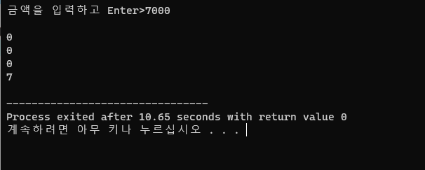
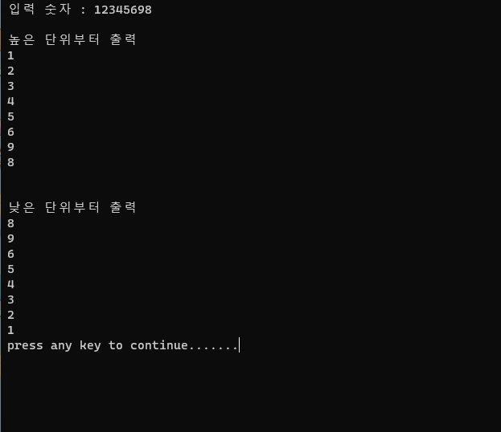
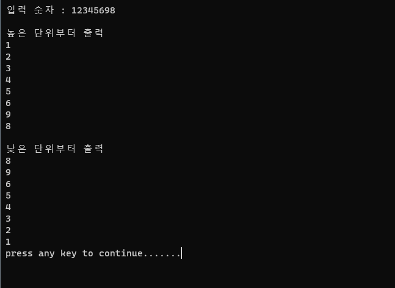
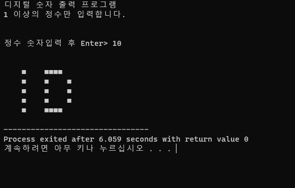
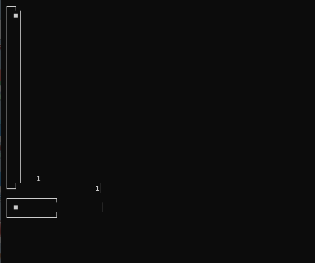
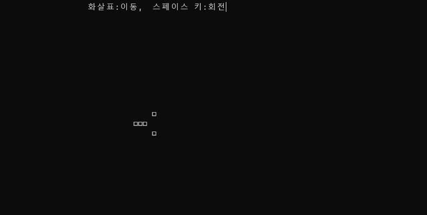

## 높은단위 낮은단위 숫자출력

[]

- - -

## 예제 5_4_1

[]

- - -

## 예제 5_4_2

[]

- - -

## 예제 5_4_3

[]

- - -

## 예제 5_4_4

[]

- - -

## 예제 6_1_1

[]

- - -

## 예제 6_2_1

[]

- - -

## 예제 6_3_1

[]

- - -
